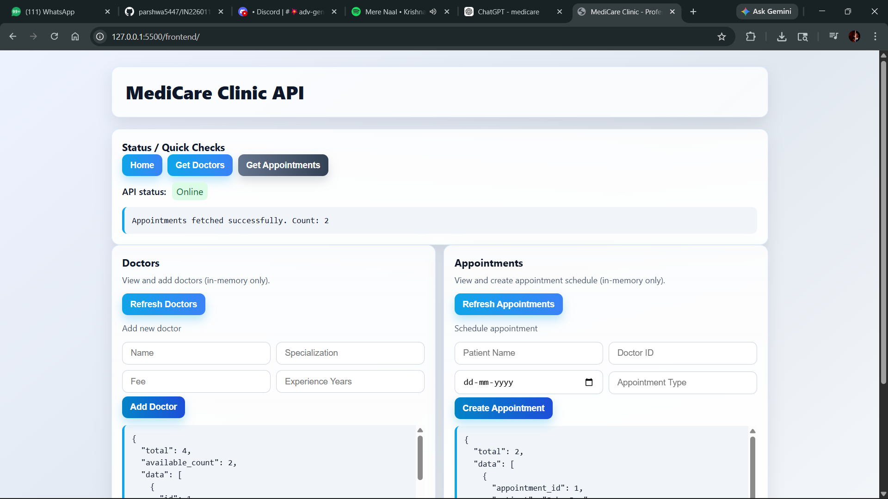
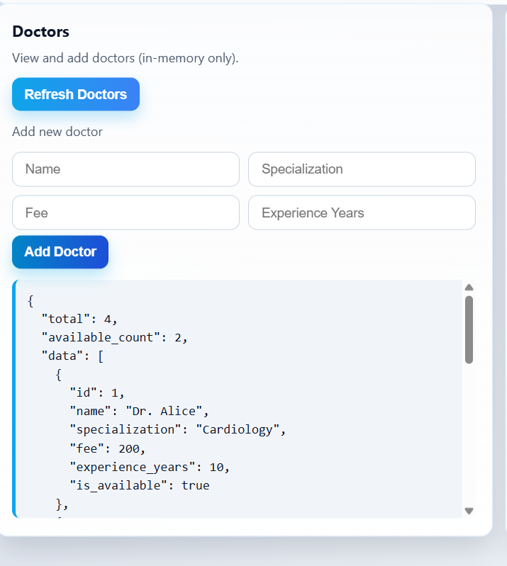
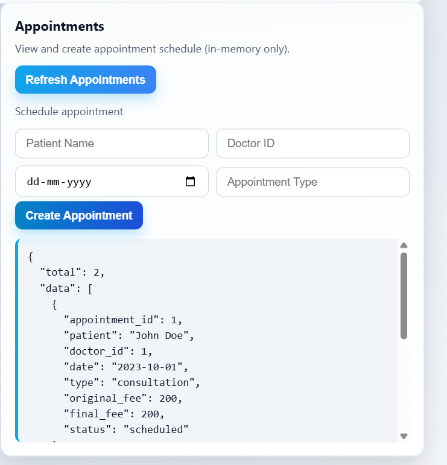

# 🏥 MediCare Clinic Management System

A full-stack clinic management system built using **FastAPI (backend)** and **HTML, CSS, JavaScript (frontend)**.

This project provides a simple and efficient way to manage doctors and patient appointments digitally.

---

## 🚀 Problem Statement

Manual clinic appointment handling is inefficient and prone to errors such as double-booking and poor record management.  
This system solves these issues by digitizing doctor availability and appointment scheduling through a REST API-based architecture.

---

## ✨ Key Features

### 🔹 Backend (FastAPI)
- RESTful API development using FastAPI
- Doctor management system
- Appointment scheduling system
- Duplicate doctor validation
- Doctor availability check before booking
- Automatic appointment ID generation
- CORS enabled for frontend integration

### 🔹 Frontend
- Clean and responsive clinic dashboard UI
- API status indicator
- View and add doctors
- View and create appointments
- Error handling for failed API calls

---

## 🛠 Tech Stack

### Backend
- Python
- FastAPI
- Uvicorn
- Pydantic

### Frontend
- HTML
- CSS
- JavaScript

---

## 📂 Project Structure

```text
IN226011502_FastAPI_Final_Project/
|
|-- backend/
|   |-- app/
|   |   `-- main.py
|   `-- requirements.txt
|
|-- frontend/
|   |-- index.html
|   `-- style.css
|
|-- Output/
|-- .gitignore
`-- README.md
```

---

## 📸 Screenshots

### 🖥 Dashboard


### 👨‍⚕️ Doctors List


### 📅 Appointments


---

## 🔌 API Endpoints

### 🏠 Base
- `GET /` → Welcome message

---

### 👨‍⚕️ Doctors
- `GET /doctors` → Get all doctors  
- `POST /doctors` → Add a new doctor  

---

### 📅 Appointments
- `GET /appointments` → Get all appointments  
- `POST /appointments` → Create new appointment  

---

## ⚙️ How to Run the Project

### 1️⃣ Clone Repository
```bash
git clone https://github.com/parshwa5447/IN226011502_FastAPI_Final_Project.git
cd IN226011502_FastAPI_Final_Project
```

---

### 2️⃣ Create Virtual Environment
```bash
python -m venv venv
```

#### Activate (Windows)
```powershell
.\venv\Scripts\Activate.ps1
```

---

### 3️⃣ Install Dependencies
```bash
pip install -r backend/requirements.txt
```

---

### 4️⃣ Run Backend
```bash
cd backend
python -m uvicorn app.main:app --host 127.0.0.1 --port 8000
```

👉 Backend runs at:  
http://127.0.0.1:8000/

---

### 5️⃣ Run Frontend
```bash
cd frontend
python -m http.server 8080
```

👉 Frontend runs at:  
http://127.0.0.1:8080/

---

## 🔄 How It Works

- Frontend sends requests using `fetch()`
- FastAPI processes requests and returns JSON responses
- Doctor availability is validated before appointment creation
- Data is stored temporarily in memory

---

## ⚠️ Limitations

- Uses in-memory storage (data resets on server restart)
- No authentication system
- No persistent database

---

## 🚀 Future Improvements

- Integrate MySQL / PostgreSQL database
- Add JWT-based authentication system
- Build modern frontend using React
- Implement update & delete operations (CRUD)
- Deploy on cloud (AWS / Render / Railway)

---

## 🧠 Learning Outcomes

- Built REST APIs using FastAPI
- Understood backend architecture design
- Implemented frontend-backend integration
- Learned API testing and debugging
- Applied real-world logic (availability & scheduling)

---

## 👨‍💻 Author

**Parshwa Desai**

---

## 📌 License

This project is created for educational and learning purposes.
